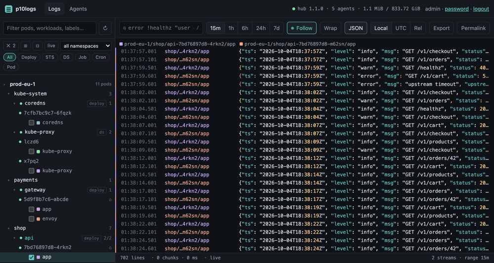
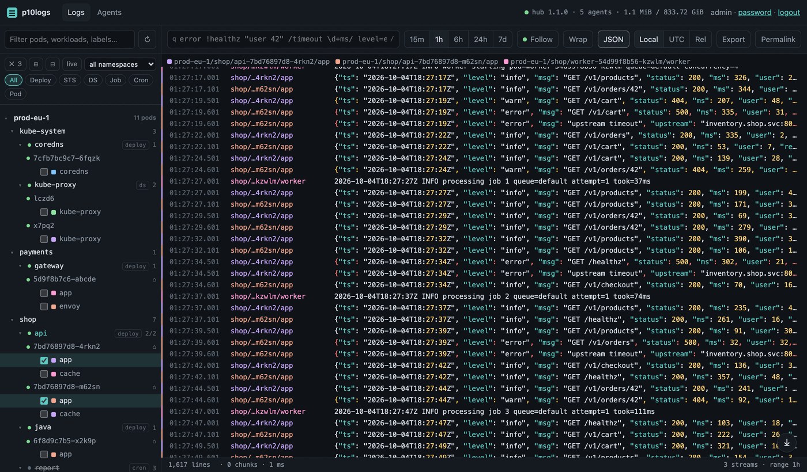
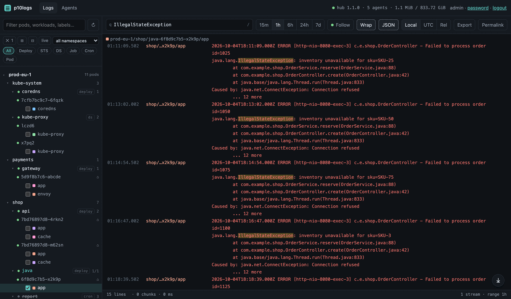
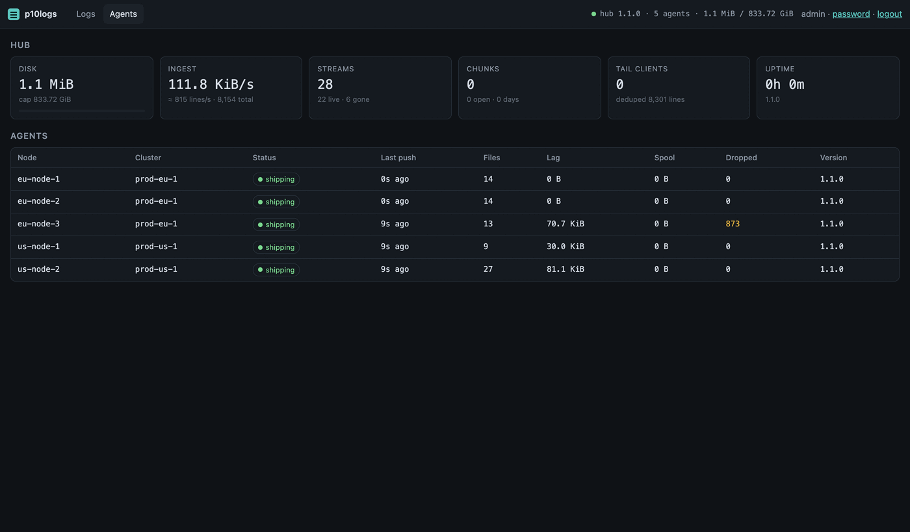

# p10logs

**Persistent, multi-cluster Kubernetes pod logs. Nothing else.**

p10logs is a small, self-contained log system for Kubernetes: one DaemonSet agent that
reads container log files straight off the node, one hub with a persistent volume that
stores and indexes them, and a fast built-in UI to browse, search, and tail pods across
any number of clusters. No metrics pipeline, no Prometheus, no Grafana, no Elasticsearch,
no object store required.

> Status: **v1.1.** Formats and the `/api/v1` API are frozen since 1.0 (see
> [docs/FORMATS.md](docs/FORMATS.md)). Verified by unit tests, a local end-to-end run
> (`make e2e`: ingest, filter, live tail, agent restart without loss or duplicates,
> kubelet rotation, `kill -9` hub recovery with WAL replay, pod deletion, index
> rebuild, per-cluster tokens, viewer roles, federation, S3 offload), a single-node kind
> run (`make e2e-kind`: chart install, real kubelet log files, label enrichment, Helm
> upgrade with data retained) and a multi-cluster kind run (`make e2e-multi`: 3-node hub
> cluster + spoke cluster pushing over the network, demo workloads, restart boundaries,
> 20 KiB lines, multiline traces, rate limits, token scoping, hub outage with spool and
> drain). Not yet run on a production cluster. See [CHANGELOG.md](CHANGELOG.md).

---

## Screenshots



|                                                                                                                   |                                                                                               |
|-------------------------------------------------------------------------------------------------------------------|-----------------------------------------------------------------------------------------------|
|   |    |
| Tree grouped by workload; three streams interleaved with a colour per pod, restart boundaries, JSON highlighting. | Filter `IllegalStateException` over joined stack traces, Wrap mode, search terms highlighted. |



## Why another log tool

Teams that just want "show me the logs of that pod, including from before it
restarted, across my clusters" currently choose between two bad options:

**Live viewers without storage** (Dozzle, kubetail, stern, `kubectl logs`) all stream
through the Kubernetes API server: browser → apiserver → kubelet → log file. Every open
container is a long-lived connection through the control plane, the kubelet polls and
issues a CRI status call per stream per second, the kubelet hard-kills any stream after
4 hours, only the *current* 10 MiB log file is ever visible, and nothing survives a pod
restart. Dozzle additionally polls the metrics API for CPU/RAM charts and does all
parsing and rendering in the browser, which is where its "UI timed out" and
200-container freezes come from. The lag you feel is structural, not a bug.

**Full observability stacks** (Elastic, SigNoz/ClickHouse, Loki + Grafana, OpenObserve)
persist logs but ship metrics, traces, dashboards, compactors, and multi-gigabyte
memory floors along with them. Loki's monolithic mode runs 1.5–7 GiB; Elastic and
ClickHouse start at 4 GB and want much more.

VictoriaLogs is the honest exception: a single binary that stores logs in well under
2 GiB at high ingest rates. If you already run it, keep it. p10logs exists for people
who want something even smaller and more opinionated: a **pod-centric UI**, a
**one-command Helm install** that covers many clusters, **built-in auth**, and a
**grep-like filter** instead of a query language.

## What you get

- **Every pod's stdout/stderr, persisted.** Logs survive pod restarts, pod deletion,
  node reboots, and p10logs upgrades. Retention is time- and size-based, per namespace
  if you want.
- **No API-server load.** The agent reads `/var/log/pods` directly; namespace, pod,
  container, and restart count come from the file path. Zero watches by default; with
  label enrichment on, exactly one watch per node, scoped to that node's pods.
- **Multi-cluster in one screen.** Agents in any cluster push to one hub over HTTPS with
  a bearer token, egress-only, so private clusters and home labs work. Or run a hub per
  cluster and federate queries.
- **Fast UI.** Tree of `cluster → namespace → pod → container`, live tail of one or many
  pods with server-side rate limiting, virtualized rendering, time range, filter,
  export, permalinks. Never opens a Kubernetes API stream.
- **Small.** Target footprint: agent ~30 MiB RSS, hub a few hundred MiB for tens of
  GB/day. Two static Go binaries, one Helm chart, one PVC.
- **Exactly-once, in practice.** Agent checkpoints on the node; hub deduplicates by
  file offset. Restarting anything neither loses nor duplicates lines.
- **Logs only.** No metrics endpoint unless you turn it on. No scraping. No traces.

## What it deliberately is not

- Not a query language or analytics engine. Filters are `word`, `!word`, `"phrase"`,
  `/regex/`, `key=value` for JSON lines. No aggregations, no SQL, no LogQL.
- Not a full-text search cluster. Search is a time-bounded scan; a trigram bloom
  filter per sealed chunk skips chunks that cannot contain the search words, so
  cluster-wide "find this string in the last 30 days" is cheap when the string is rare,
  and bounded by `query.maxScanBytes` when it is not.
- Not HA. The hub is a single StatefulSet replica on a PVC; agents buffer to disk while
  it is down (restarts take seconds; the WAL makes them lossless). Back up the PVC or
  enable object-storage offload for durability beyond one disk.
- Not a collector for arbitrary files, syslog, or journald. Container stdout/stderr only.
- Not an alerting system.

## How it compares

|                                 | p10logs                     | Dozzle                        | kubetail                        | Loki + Alloy         | VictoriaLogs + vlagent | Elastic / SigNoz |
|---------------------------------|-----------------------------|-------------------------------|---------------------------------|----------------------|------------------------|------------------|
| Reads logs from                 | node files                  | kube API                      | kube API (or agent: node files) | node files           | node files             | node files       |
| Survives pod restart / deletion | yes                         | no                            | no                              | yes                  | yes                    | yes              |
| Rotated log files visible       | yes                         | no                            | no                              | yes                  | yes                    | yes              |
| Load on apiserver               | none                        | 1 stream per container viewed | 1 stream per container viewed   | none (labels: watch) | none                   | none             |
| Multi-cluster                   | one chart, push or federate | Docker only                   | desktop context switch          | tenants              | tenants                | yes              |
| Typical hub RAM                 | hundreds of MiB (target)    | n/a                           | n/a                             | 1.5–7 GiB            | 0.6–2 GiB              | ≥ 4 GB           |
| Metrics shipped by default      | no                          | CPU/RAM polling               | no                              | Grafana stack        | optional               | full platform    |
| UI                              | pod tree, tail, search      | container list, tail, stats   | pod tail, search                | Grafana              | vmui (query-first)     | full platform    |
| Auth built in                   | token + basic/OIDC          | users file                    | none                            | Grafana              | none (vmauth)          | yes              |
| Query language                  | grep-like                   | none                          | none                            | LogQL                | LogsQL                 | KQL / SQL        |

Numbers as of 2026-09 from independent benchmarks and vendor docs:
[VictoriaLogs vs Loki (Truefoundry)](https://www.truefoundry.com/blog/victorialogs-vs-loki),
[log collectors benchmark 2026 (VictoriaMetrics)](https://victoriametrics.com/blog/log-collectors-benchmark-2026/),
[Loki sizing](https://grafana.com/docs/loki/latest/setup/size/),
[SigNoz capacity planning](https://signoz.io/docs/setup/capacity-planning/community/resources-planning/),
[Dozzle K8s guide](https://dozzle.dev/guide/k8s), [kubetail cluster agent](https://docs.kubetail.com/cluster-resources/cluster-agent).

## Architecture

```
  every node                                        one hub (StatefulSet + PVC)
  ┌────────────────────────────┐                    ┌────────────────────────────────┐
  │ /var/log/pods/…/0.log      │                    │ POST /api/v1/push              │
  │        │ scan 2s + tail    │   zstd NDJSON      │   auth → WAL → dedup → chunk   │
  │        ▼                   │ ───────────────►   │        │                       │
  │ p10logs-agent (DaemonSet)  │   HTTPS, bearer    │   ┌────┴─────┐                 │
  │  parse CRI · batch · ship  │                    │   ▼          ▼                 │
  │  checkpoint · disk buffer  │                    │ /data/days  live bus → SSE     │
  └────────────────────────────┘                    │ index.sqlite                   │
                                                    │ retention loop                 │
   other clusters ───────────────────────────────►  │ GET /api/v1/{streams,query,    │
   (agents only, egress-only)                       │   tail,export}  ·  UI at /     │
                                                    └────────────────────────────────┘
```

- **Agent**: Go, DaemonSet, runs as root with a read-only filesystem and no
  capabilities. Discovers `<ns>_<pod>_<uid>/<container>/<restart>.log`, parses the CRI
  format (including 16 KiB partial-line reassembly), follows kubelet rotation by inode,
  checkpoints read offsets to a hostPath so restarts resume exactly, batches and
  zstd-compresses lines, and pushes over HTTP. If the hub is unreachable it spools to a
  bounded disk buffer on the node.
- **Hub**: Go, StatefulSet with one PVC. Every push is fsynced to a write-ahead log
  and acknowledged, buffered per stream in memory, then written to a per-stream chunk
  under a UTC day directory as a large zstd frame. Chunks seal at 4 MiB or 5 minutes
  with a footer (frame time index + trigram bloom filter), the SQLite catalog is
  derived state, retention deletes day directories, cold chunks can live in any
  S3-compatible bucket, and the UI is embedded.
- **UI**: single-page app embedded in the hub binary. Virtualized list, no external
  assets, all state in the URL.

Full details, on-disk formats, wire protocol, and failure-mode table:
[docs/ARCHITECTURE.md](docs/ARCHITECTURE.md).

## Quick start

Requirements: Kubernetes ≥ 1.26, Helm ≥ 3.8, a default StorageClass, containerd or
CRI-O (legacy Docker works with one extra value).

```bash
helm install p10logs oci://ghcr.io/p10node/charts/p10logs \
  --namespace p10logs --create-namespace \
  --set global.clusterName=dev

# hostPath volumes need the "privileged" Pod Security level in this namespace
kubectl label ns p10logs pod-security.kubernetes.io/enforce=privileged --overwrite

kubectl -n p10logs port-forward svc/p10logs-hub 8080:8080
open http://localhost:8080
```

First sign-in is `admin` / `admin`; the hub then asks you to set a new password and keeps
it hashed on its data volume. Prefer to manage it outside? Set
`hub.auth.ui.basic.password` or `existingSecret` and no onboarding happens. For a public
demo add `hub.auth.ui.basic.lockPassword=true`: the configured password is the only one
accepted and nobody can change it from the UI.

Within a few seconds the tree fills with every namespace and pod on the cluster,
including logs that were already on disk before p10logs was installed (current plus
rotated files, up to what kubelet kept).

## Multi-cluster

**Hub + spokes** (default recommendation): install once with an Ingress in the central
cluster, then install agents only in each other cluster:

```bash
# central
helm install p10logs oci://ghcr.io/p10node/charts/p10logs -n p10logs --create-namespace \
  --set global.clusterName=central \
  --set hub.ingress.enabled=true \
  --set 'hub.ingress.hosts[0].host=logs.example.com' \
  --set 'hub.ingress.tls[0].secretName=p10logs-tls' \
  --set 'hub.ingress.tls[0].hosts[0]=logs.example.com'

TOKEN=$(kubectl -n p10logs get secret p10logs-ingest -o jsonpath='{.data.token}' | base64 -d)

# each spoke
helm install p10logs oci://ghcr.io/p10node/charts/p10logs -n p10logs --create-namespace \
  --set global.clusterName=prod-eu-1 \
  --set hub.enabled=false \
  --set agent.hub.url=https://logs.example.com \
  --set agent.hub.token=$TOKEN
```

Spokes need outbound HTTPS only. Serve the hub over HTTP/2 (any TLS ingress does) so
several browser tabs can tail at once; HTTP/1.1 caps a browser at six connections per
host. Agents compress before sending (text logs shrink
5–10×) and spool to local disk during hub outages.

**Per-cluster tokens** (`hub.auth.clusterTokens`) stop a leaked spoke token from
writing as another cluster. **Federation** (hub per cluster, one UI: `hub.federation.peers`)
is described in [docs/MULTI_CLUSTER.md](docs/MULTI_CLUSTER.md); stream ids from a peer
appear as `<peer>/<id>` and the tree shows which hub serves each cluster.

## Configuration

All configuration is Helm values. The important ones:

| Value                                             | Default                | Meaning                                                                                                                                                                                                   |
|---------------------------------------------------|------------------------|-----------------------------------------------------------------------------------------------------------------------------------------------------------------------------------------------------------|
| `global.clusterName`                              | `default`              | Label stamped on every line. Unique per hub.                                                                                                                                                              |
| `agent.enabled` / `hub.enabled`                   | `true` / `true`        | Topology switches. Spoke = `hub.enabled=false`.                                                                                                                                                           |
| `agent.hub.url`, `agent.hub.token`                | in-cluster / generated | Where agents push, and with what.                                                                                                                                                                         |
| `agent.collect.excludeNamespaces`                 | `[]`                   | Skip namespaces at the source (zero cost).                                                                                                                                                                |
| `agent.collect.excludeContainers`                 | `[]`                   | e.g. `[istio-proxy]`.                                                                                                                                                                                     |
| `agent.enrich.enabled`, `.labels`, `.annotations` | `false`                | Attach selected pod labels/annotations via one node-scoped watch; then `label=app:api` works as a selector. Also adds `_owner` (`Deployment/api`, `CronJob/report`, …) so the UI groups pods by workload. |
| `agent.multiline.enabled`                         | `false`                | Join stack traces by start-pattern.                                                                                                                                                                       |
| `agent.buffer.maxBytes`                           | `256Mi`                | Disk spool per node while hub is down.                                                                                                                                                                    |
| `agent.rateLimit.linesPerSecondPerContainer`      | `0`                    | Cap a log-spamming pod.                                                                                                                                                                                   |
| `hub.storage.persistence.size`                    | `50Gi`                 | PVC size.                                                                                                                                                                                                 |
| `hub.storage.retention.maxAge`                    | `168h`                 | Delete days older than this.                                                                                                                                                                              |
| `hub.storage.retention.maxDiskBytes`              | `0` = 90 % of PVC      | Delete oldest days when exceeded.                                                                                                                                                                         |
| `hub.storage.retention.overrides`                 | `[]`                   | Per `<cluster>/<namespace>` glob, e.g. keep `prod/*` 30 d.                                                                                                                                                |
| `hub.storage.objectStore.*`                       | off                    | Copy sealed chunks to any S3-compatible bucket after `uploadAfter`; evict local copies first under disk pressure; cold reads are transparent.                                                             |
| `hub.auth.ui.mode`                                | `basic`                | `none`, `basic`, or `oidc`.                                                                                                                                                                               |
| `hub.auth.ui.basic.lockPassword`                  | `false`                | Demo hubs: the configured password cannot be changed from the UI (needs `password` or `existingSecret`).                                                                                                  |
| `hub.auth.clusterTokens`, `hub.auth.roles`        | `[]`                   | Ingest tokens bound to clusters; viewer roles bound to cluster/namespace globs.                                                                                                                           |
| `hub.ingress.*` / `hub.httpRoute.*`               | off                    | Expose the hub.                                                                                                                                                                                           |
| `hub.federation.peers`                            | `[]`                   | Other hubs to query, tail and export through this one.                                                                                                                                                    |
| `hub.limits.perCluster.bytesPerSecond`            | `0` = unlimited        | Throttle a noisy spoke cluster.                                                                                                                                                                           |
| `hub.metrics.enabled`                             | `false`                | Prometheus endpoint. Off on purpose.                                                                                                                                                                      |

See [charts/p10logs/values.yaml](charts/p10logs/values.yaml) for everything, with
comments.

### GitOps (ArgoCD, Flux)

Auto-generated secrets rely on Helm `lookup()`, which is empty when the chart is
rendered with `helm template`. Create the ingest and UI secrets yourself and point
`hub.auth.existingSecret`, `agent.hub.existingSecret`, and
`hub.auth.ui.basic.existingSecret` at them, or the values change on every sync.
Agents re-read the token file on `401`, so rotating a token never needs a restart.

### Legacy Docker / cri-dockerd nodes

```bash
--set agent.hostPaths.docker=/var/lib/docker/containers
```

## Using the UI

- **Tree** on the left: cluster → namespace → workload → pod → container. Pods are grouped
  under their Deployment / StatefulSet / DaemonSet / Job / CronJob (from the agent's
  `_owner` label when `agent.enrich.enabled`, otherwise guessed from the pod name) with a
  kind badge, pod count and restart total; clicking a workload tails all of its
  containers. Pods that no longer exist stay listed (greyed) until their logs age out;
  the **live** toggle hides them. Under the search box: unselect all, expand / collapse
  all, a namespace selector and workload-kind chips. Search matches pod, workload, kind
  and label text.
- **Tail**: click a container, or select several pods to interleave them by timestamp
  with a colour per pod (globs such as `pod=api-*` are an API feature). Follow mode uses SSE; if a pod
  logs faster than the per-client cap the server drops and shows a `dropped N lines`
  marker rather than freezing the tab. Only visible rows are rendered; the tab keeps at
  most 10 000 lines in memory and re-fetches older ones from the hub when you scroll up.
- **Time range**: presets or absolute. Historic views page backwards from the newest
  line.
- **Filter box**, same grammar as the API `q` parameter:

  | Syntax                       | Matches                                       |
  |------------------------------|-----------------------------------------------|
  | `error`                      | lines containing `error` (case-insensitive)   |
  | `!healthz`                   | lines not containing `healthz`                |
  | `"user 42"`                  | exact phrase                                  |
  | `/timeout \d+ms/`            | RE2 regex                                     |
  | `level=error`                | JSON lines whose `level` field equals `error` |
  | `error !healthz level=error` | all terms must match                          |

- **Export** downloads the current view as text (the API also serves `format=ndjson`).
  **Permalink** copies a URL with every setting.

## HTTP API

All endpoints are under the hub. UI auth applies (`Authorization: Bearer` also accepted
for API tokens).

| Method & path                                            | Purpose                                                                               |
|----------------------------------------------------------|---------------------------------------------------------------------------------------|
| `POST /api/v1/push`                                      | Agent ingest. Bearer ingest token. zstd NDJSON body.                                  |
| `GET /api/v1/streams?cluster=&namespace=&pod=&since=`    | List streams (pods/containers) with first/last timestamps and restart counts.         |
| `GET /api/v1/query?…&start=&end=&q=&limit=&dir=&cursor=` | Historic lines, newest-first by default, paginated.                                   |
| `GET /api/v1/tail?…&q=`                                  | Server-Sent Events live tail.                                                         |
| `GET /api/v1/export?…&format=txt\|ndjson`                | Streamed download.                                                                    |
| `GET /api/v1/status`                                     | Hub health, disk usage, ingest rate, one row per agent (node, last seen, lag, spool). |
| `GET /healthz`, `GET /readyz`                            | Probes.                                                                               |
| `GET /metrics`                                           | Only if `hub.metrics.enabled`.                                                        |

Selectors (`cluster`, `namespace`, `pod`, `container`) accept exact values or globs
(`api-*`); `uid` pins one pod instance; `sid` selects stream ids from `/streams`;
`label=key:value` (repeatable) matches enrichment labels. Timestamps are RFC 3339, unix seconds/millis/nanos, `now`, or relative (`-15m`, `-6h`, `-7d`, `-2w`). Query
responses report `chunks` read, `skipped_chunks` excluded by bloom filters,
`scanned_bytes`, `ms`, `truncated`, and `next` for the older page.

Example:

```bash
curl -s -u admin:$PW 'http://localhost:8080/api/v1/query?namespace=payments&pod=api-*&start=-1h&q=error+!healthz&limit=200'
```

## Storage and retention

- Data lives in `/data` on the hub PVC: `days/<YYYYMMDD>/<cluster>/<ns>/<pod-uid>/<container>/*.chunk`
  plus `index.sqlite`. Chunks are append-only and, once sealed, immutable.
- Disk usage is roughly **raw × 0.1–0.2** (zstd on text logs). 30 nodes producing
  15 GB/day raw for 7 days need about 20 GB.
- Retention runs every minute: delete day directories older than `maxAge`, then
  oldest days until under `maxDiskBytes`, always keeping today. Per-namespace overrides
  delete just those sub-directories.
- Optional cold tier: sealed chunks are copied to an S3-compatible bucket (AWS S3,
  MinIO, Cloudflare R2, Backblaze B2, GCS in interoperability mode) after
  `uploadAfter`. Under disk pressure the hub evicts local copies of offloaded chunks
  before it deletes any day. Queries fetch cold chunks into a bounded cache. Deleting
  a day also deletes its objects. `--rebuild-index` lists the bucket, so a hub with an
  empty PVC and the bucket recovers everything.
- `p10logs-hub --check` verifies every chunk footer, open chunk, the WAL and the index
  without changing anything and exits non-zero on problems.
- Backup = snapshot the PVC, or rely on the bucket. Restore = mount it, or start with
  an empty PVC and run `--rebuild-index`.

## What survives what

| Event                                                                            | Lines lost?                                                    | Lines duplicated?        |
|----------------------------------------------------------------------------------|----------------------------------------------------------------|--------------------------|
| Pod restarts / crashes                                                           | no, previous restart's file was already shipped                | no                       |
| Pod deleted                                                                      | no, agent drains the file before kubelet removes the directory | no                       |
| Agent pod restarts or upgrades                                                   | no, resumes from checkpoint on hostPath                        | no, hub dedups by offset |
| Node reboots                                                                     | no, same checkpoint                                            | no                       |
| Hub down < buffer capacity                                                       | no, spooled on nodes                                           | no                       |
| Hub down > buffer capacity                                                       | oldest spooled batches dropped, a marker line is written       | no                       |
| Hub crashes mid-write                                                            | no, un-acked batches are resent                                | no                       |
| Pod logs faster than the agent reads for longer than kubelet keeps rotated files | yes (default window ≈ 50 MiB per container)                    | no                       |
| PVC full                                                                         | ingest paused (503), agents spool, retention frees space       | no                       |

## Security

- Agent: `hostPath` read-only mounts of `/var/log/pods` (files are root-owned 0640, so
  the agent runs as UID 0), read-only root filesystem, all capabilities dropped, no
  `privileged`. The namespace needs the `privileged` Pod Security level solely because
  of `hostPath`.
- Agent → hub: bearer token (generated on install, or yours), TLS via your Ingress,
  optional private CA. Per-cluster tokens in v0.3.
- Hub UI/API: `basic` (default: login form with a session cookie; first run is
  `admin`/`admin` followed by a forced password change, passwords stored as PBKDF2-SHA256
  on the data volume, changeable in the UI; or a password from a Kubernetes secret,
  optionally locked with `lockPassword` for demo hubs),
  `oidc` (authorization-code flow with an email or domain allow-list, roles by user or
  domain), or `none` if you front it with your own SSO proxy. HTTP Basic headers and
  `hub.auth.apiTokens` bearer tokens work for scripts in any mode.
- Viewer roles (`hub.auth.roles`) scope reads: a role lists users (basic usernames or
  OIDC emails), email domains, or its own API tokens, plus cluster and namespace globs.
  Once any role exists, identities that match none are denied; global `apiTokens` stay
  unrestricted. Federated queries carry the caller's scope to each peer through the
  peer token's own role on that hub.

### OIDC

The hub is a standard OpenID Connect relying party (built on `coreos/go-oidc`), so any
open-source provider works: Keycloak, Dex, Authentik, Zitadel, Kanidm, or a hosted one
such as Google or Entra ID. Register a confidential client with redirect URI
`https://<hub-host>/auth/callback`, put the client secret in a Kubernetes secret under
the key `client-secret`, then:

```yaml
hub:
  auth:
    ui:
      mode: oidc
      oidc:
        issuerUrl: https://keycloak.example.com/realms/main
        clientId: p10logs
        clientSecretRef: p10logs-oidc
        allowedDomains: [example.com]      # or allowedEmails: [a@example.com]
    publicUrl: https://logs.example.com   # only if your proxy hides the scheme
```

Sessions are HMAC-signed cookies valid for 12 hours; the signing key is generated at
start (set `auth.sessionKeyFile` in `hub.yaml` to keep sessions across restarts).
- Hub runs as non-root UID 65532, read-only root filesystem.
- No component ever needs `pods/log`, `exec`, or write access to the Kubernetes API.
  The only optional RBAC is `pods get/list/watch` for label enrichment.

## Resource footprint

p10logs is designed to be the cheapest thing that still persists logs. Measured with
`bench/run.sh` on a laptop (Apple M1 Pro, local processes, ~180-byte JSON lines; full
table and caveats in [bench/RESULTS.md](bench/RESULTS.md)); reference numbers are from
independent 2026 benchmarks (links above).

|                             | p10logs (measured)                                                                                        | Reference                                                           |
|-----------------------------|-----------------------------------------------------------------------------------------------------------|---------------------------------------------------------------------|
| Agent, per node             | 31 MiB RSS / 0.3 % of a core at 2 000 lines/s; 44 MiB / 3.4 % at 10 000 lines/s                           | vlagent 28 MiB, Fluent Bit 78 MiB, Vector 154 MiB at 10 k lines/s   |
| Hub                         | 58 MiB / 2 % at 2 000 lines/s; 100 MiB / 7 % at 10 000 lines/s (ingest only, memtable budget 128 MiB max) | VictoriaLogs 0.6–2 GiB, Loki 1.5–7 GiB, Elastic / ClickHouse ≥ 4 GB |
| Disk                        | raw ÷ 7.3–8.7 (zstd level 1, 256 KiB+ frames)                                                             | Loki 501 GiB vs VictoriaLogs 318 GiB for the same 500 GB week       |
| Idle on a Linux node (kind) | agent 18.5 MiB, hub 24 MiB                                                                                |                                                                     |
| Images                      | agent 16 MB, hub 23 MB (distroless static)                                                                |                                                                     |
| API-server load             | zero requests (one node-scoped watch if enrichment is on)                                                 | Dozzle / kubetail: one long-lived stream per container per viewer   |
| Extra components            | none                                                                                                      | metrics-server, Grafana, Prometheus, object store, ClickHouse, JVM  |

Why it stays small:

- The agent reads files sequentially from the page cache, keeps one reusable buffer per
  batch, and never opens a Kubernetes API stream. Excluded namespaces cost nothing.
- The hub does one zstd frame append per batch and one `fdatasync` per second. There is
  no inverted index, no compactor, no LSM merges; a bloom filter is built once when a
  chunk is sealed.
- Live tail is one upstream subscription fanned out to N browsers with a per-client cap,
  so a hundred people watching the same pod cost about the same as one.
- There is no metrics pipeline to scrape, store, or render. The `/metrics` endpoint is off
  unless you enable it.

Sizing guide (7-day retention):

| Cluster                | Agents       | Hub              | PVC                             |
|------------------------|--------------|------------------|---------------------------------|
| 5 nodes, ~1 GB/day     | 5 × 30 MiB   | ~150 MiB         | 5 Gi                            |
| 30 nodes, ~15 GB/day   | 30 × 40 MiB  | 400–600 MiB      | 20–30 Gi                        |
| 200 nodes, ~100 GB/day | 200 × 50 MiB | 1–2 GiB, ~1 core | 150–200 Gi, consider federation |

Where cost can still go if misused, and the knob that bounds it:

| Situation                                     | Bound                                                         |
|-----------------------------------------------|---------------------------------------------------------------|
| Wide regex search over many days              | `hub.query.maxScanBytes`, `hub.query.maxConcurrent`           |
| One pod logging thousands of lines per second | `agent.rateLimit.linesPerSecondPerContainer`                  |
| A noisy spoke cluster                         | `hub.limits.perCluster.bytesPerSecond`                        |
| Many tail clients                             | `hub.query.tail.maxClients`, `maxLinesPerSecondPerClient`     |
| Hub outage                                    | `agent.buffer.maxBytes` per node, then oldest batches dropped |

For comparison, a typical kube-prometheus-stack install runs at 2–4 GB before a single
log line is stored; a Loki-plus-Grafana stack is in the same range. p10logs targets
roughly 5–10× less for the "just pod logs" job.

## Roadmap

| Version         | Scope                                                                                                                                                                                                                                                                                                                                                                                                                                                                                       |
|-----------------|---------------------------------------------------------------------------------------------------------------------------------------------------------------------------------------------------------------------------------------------------------------------------------------------------------------------------------------------------------------------------------------------------------------------------------------------------------------------------------------------|
| **v0.1** (done) | Agent (discover, CRI + docker-json parse, rotation + `.gz` backfill, checkpoint, batch, zstd push, disk spool, rate limit, multiline, heartbeat). Hub (ingest, cursor dedup, crash-safe chunks, SQLite index + `--rebuild-index`, query, SSE tail with per-client cap, retention by age/size/namespace, basic + OIDC auth, API tokens, per-cluster rate limit, agents status). UI (tree, multi-pod tail, restart markers, time range, filter, export, permalinks, agents page). Helm chart. |
| **v0.2** (done) | Label/annotation enrichment (one node-scoped watch, no client-go) and `label=` selectors. Trigram bloom filter per chunk (`skipped_chunks` in query stats). `values.schema.json`. GitHub Actions: CI (unit, local e2e, chart, kind) and release (multi-arch images + OCI chart to ghcr.io/p10node). Benchmark script and numbers (`bench/`).                                                                                                                                                |
| **v0.3** (done) | Federation, object-storage offload, per-cluster ingest tokens, viewer roles, Artifact Hub metadata, WAL + memtable storage (replaces the compression-dictionary idea: large frames make it unnecessary).                                                                                                                                                                                                                                                                                    |
| **v1.0** (done) | Format and API freeze (`docs/FORMATS.md`), `--check`, Helm upgrade test on kind, docs site, changelog.                                                                                                                                                                                                                                                                                                                                                                                      |
| **v1.1** (done) | Multi-node + multi-cluster kind environment (`make e2e-multi`) with demo workloads (`hack/demo/`), hub outage / spool / drain test, multiline timeout and size-flush fixes, `hub.service.nodePort`, `make images-tar`.                                                                                                                                                                                                                                                                      |
| next            | First production cluster (feedback round), HA hub (two replicas behind the WAL on shared storage), Windows nodes, OpenTelemetry log export.                                                                                                                                                                                                                                                                                                                                                 |

Non-goals stay non-goals: no metrics, no traces, no query language, no alerting.

## Development

```
cmd/p10logs-agent, cmd/p10logs-hub   entry points
internal/{cri,tail,ship,enrich,agent}                                           agent
internal/{wal,chunk,bloom,index,store,s3,query,tailbus,federation,auth,api,hub}  hub
internal/wire                        push wire format shared by both
ui/                                  single-file vanilla JS console, embedded with go:embed
charts/p10logs                       Helm chart (lint: make lint, render: make template)
docs/                                ARCHITECTURE.md, MULTI_CLUSTER.md, FORMATS.md
bench/                               load generator and published numbers
```

Go 1.26+, CGO disabled (`modernc.org/sqlite`, `klauspost/compress/zstd`,
`coreos/go-oidc`; no client-go). Images are distroless static, linux/amd64 and
linux/arm64, built by `.github/workflows/release.yml` on `v*` tags; CI runs unit tests,
the local e2e, chart lint and the kind e2e on every PR.

```bash
make build           # bin/p10logs-agent, bin/p10logs-hub
make test            # unit tests (CRI parser, tailer rotation, chunk recovery, store, query grammar)
make e2e             # real agent + hub over a fake /var/log/pods tree, 11 scenarios (12 with Docker: S3 offload)
make e2e-kind        # same on a single-node kind cluster with the chart and locally built images
make e2e-multi       # 3-node hub cluster + spoke cluster + demo apps on kind; prints UI URL and password
make demo            # apply hack/demo/ (JSON, crash loops, stack traces, 20 KiB lines, CronJob…) to the current context
make images-tar      # dist/p10logs-images-<ver>.tar for nodes without registry access
make run-hub         # hub on :8080, UI auth none, ingest token "dev", data in ./data
make package         # dist/p10logs-<ver>.tgz; before the first GitHub release install from this file
                     # (helm install p10logs dist/p10logs-1.1.1.tgz) with images from `make images-tar`
make run-agent       # agent tailing ./hack/fakepods into that hub
make lint template   # helm
make images          # multi-arch images via buildx
bench/run.sh 2000    # agent + hub RSS/CPU at 2 000 lines/s (see bench/RESULTS.md)
```

To see the UI locally without a cluster, run `make run-hub` and `make run-agent`, then
write CRI-format lines into `hack/fakepods/<ns>_<pod>_<uid>/<container>/0.log` and open
http://localhost:8080.

## FAQ

**Why not just use VictoriaLogs?** You can, and it is the lightest persistent backend
with independent benchmarks. p10logs trades its query language and generality for a
pod-centric UI, built-in auth, and one chart that covers many clusters with nothing
else to install. It is also small enough to read in an afternoon.

**Why not Loki?** Loki 3.x monolithic runs at 1.5–7 GiB, needs Grafana, Promtail is
end-of-life, and the simple-scalable mode was removed. Its label/chunk model is
excellent at scale and overkill for "show me this pod's logs".

**Does it need metrics-server, Prometheus, or Grafana?** No.

**Can I keep logs longer for some namespaces?** Yes, `hub.storage.retention.overrides`.

**Does the agent need the Kubernetes API?** No. Only if you enable label enrichment,
and then it watches only its own node's pods.

**What about logs written before p10logs was installed?** The agent reads every file
from the beginning on first start, including the gzipped rotated files kubelet keeps,
so you get whatever was still on disk (by default the current 10 MiB plus up to three
rotated files per container).

**Windows nodes?** Not yet; it is on the roadmap after v1.0.

**Can two hubs share a PVC for HA?** No. Use one hub plus object-store offload and PVC
snapshots, or federation for isolation.

## License

Copyright 2026 p10node. Apache-2.0, see [LICENSE](LICENSE) and [NOTICE](NOTICE).
